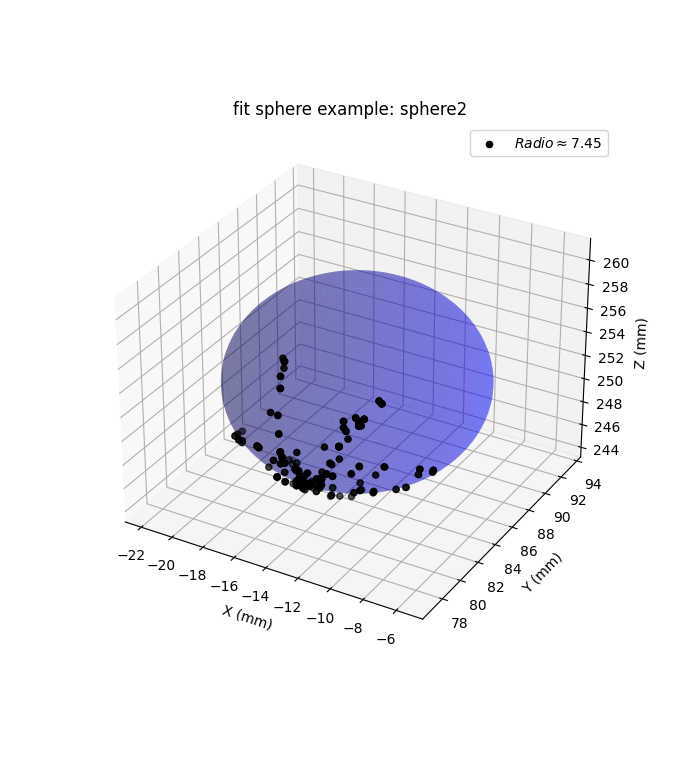

# SurgicalCubePose
This is the main repository for tracking surgical attachment for accurate monocular pose estimation with aruco boards for the purpose of providing navigation support.

## Usage example
With this example, from tracing the tip of the surgical instrument on top of a porcelain sphere with a radius of 7.5 mm, the following sphere fit is obtained, shown in the following gif.

    

To run this example:

* Clone this repository: `git clone https://github.com/camicontr/SurgicalCubePose.git`
* You need to download the `sphere/` which contains the data of the position of the instrument tip in the (x, y, z) axes in mm for three sphere fit experiments in addition to the intrinsic parameters of the camera and the relative vector of the calibration of the tip  [here](https://drive.google.com/drive/folders/1E_RvevjmIQaYquqwyUEOO_2DNnOohgSj?usp=sharing).
* Run `Recontruction.py` for read the data and fit the sphere, can chance the example between 0, 1 or 2.

A visualization of the point cloud in addition to the sphere model obtained 

    

With a radius rms error of 0.1701 mm 

## Dependencies

* Python 3
* NumPy
* Pandas
* Scipy
* OpenCV
* Sklearn
* circle_fit
* Scikit-surgery-sphere-fitting
