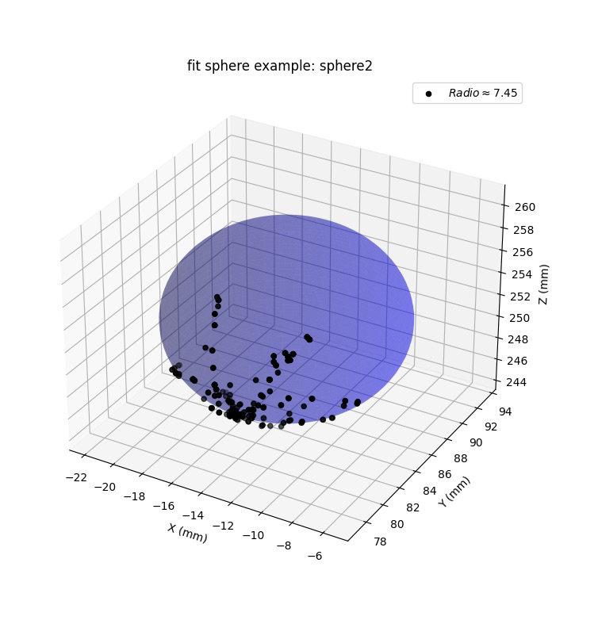

# SurgicalCubePose
This is the main repository for tracking surgical attachment for accurate monocular pose estimation with aruco boards to provide navigation support in an intraoperative environment.

## Structure of the repository
(`main.py`) is the principal program where from the images the pose of the tip of the instrument is estimated for each frame, (`calibration_tip.py`) is where the instrument tip is calibrated using two different methods, one of these least squares and some utility functions (`auxiliar_functions.py`). Finally in (`visualization.py`) the models of the experiments carried out are fitted.

## Usage example
From the tracking of the tip of the surgical instrument on a porcelain sphere of 7.5 mm radius hidden in a corpus spongiosum, a sphere fit model with a radius rms error of 0.1701 mm is obtained, shown in the gif.

<p align="center">
    
</p>

To run this example:

* Clone this repository: `git clone https://github.com/camicontr/SurgicalCubePose.git`
* Create env
```bash
pip install virtualenv
```
```bash
python -m venv envv
```
* Activate env
```bash
source env/bin/activate
```
* Install requirements
```bash
pip install -r requirements.txt
```

* You need to download the `sphere/` folder which contains the data of the position of the instrument tip in the (x, y, z) axes in mm for three sphere fit experiments in addition to the intrinsic parameters of the camera [here](https://drive.google.com/drive/folders/1uhU6IE9X8NizRNrs7ECeyxzukqAC4v5q?usp=sharing).
* Run `visualization.py` to read the data and fit the sphere, you can choose the example between 1, 2 or 3.

A visualization of the point cloud in addition to the sphere model obtained 

<p align="center">
    
</p>
